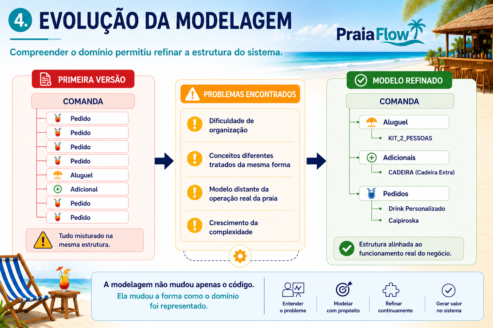
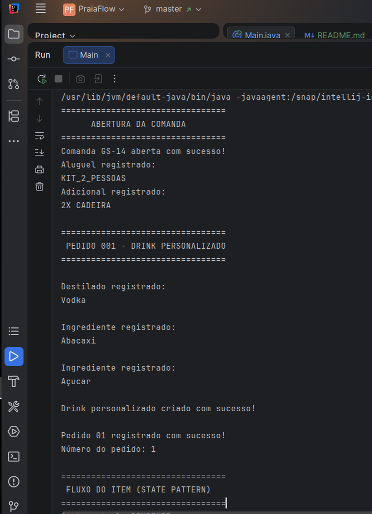
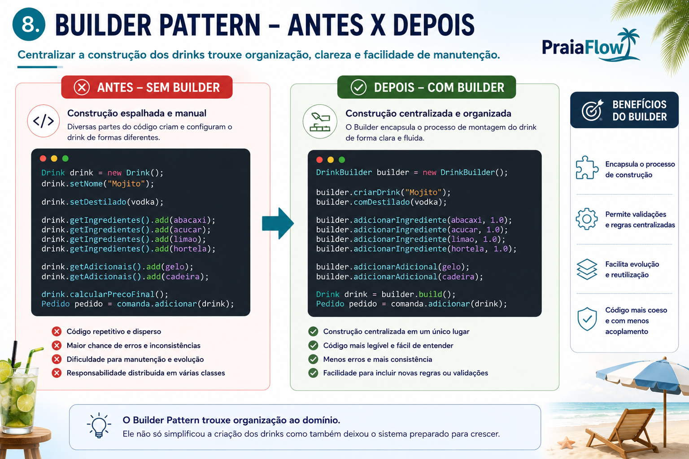
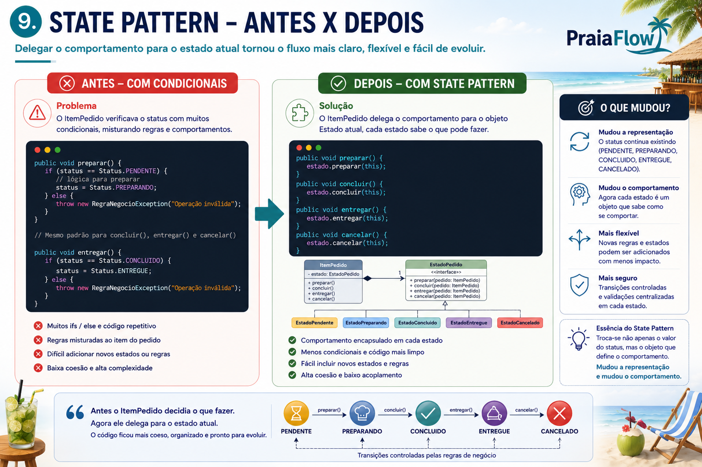
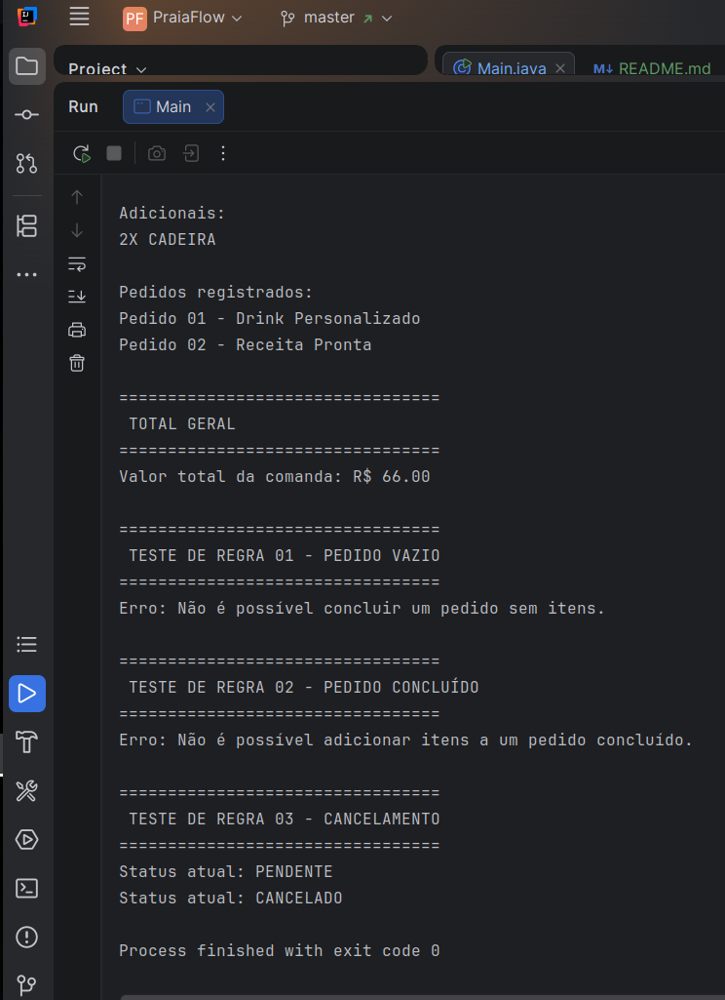

# PraiaFlow

Sistema de gestão para barracas de praia desenvolvido em Java como projeto de estudo durante a graduação em Sistemas para Internet.

O PraiaFlow surgiu inicialmente como uma proposta de sistema de comandas, mas acabou se tornando um ambiente prático para aplicar conceitos de Programação Orientada a Objetos, modelagem de domínio e padrões de projeto.


---

# Sobre o Projeto

Ao longo do desenvolvimento percebi que o maior desafio não era escrever código, mas compreender o problema que estava sendo modelado.

Conforme o entendimento do domínio evoluiu, a estrutura do sistema também precisou evoluir. Classes foram reorganizadas, responsabilidades foram redefinidas e algumas soluções que pareciam suficientes no início deixaram de atender às necessidades do projeto.

O PraiaFlow representa esse processo de evolução técnica e aprendizado.

---

# O que este projeto contempla atualmente

- Gestão de comandas;
- Gestão de pedidos e itens de pedido;
- Controle de aluguel de estruturas de praia;
- Controle de adicionais;
- Drinks personalizados;
- Regras de negócio relacionadas ao fluxo operacional;
- Aplicação dos padrões Builder e State.

---

# Evolução da Modelagem

Uma das principais mudanças realizadas durante o desenvolvimento foi a reorganização da estrutura da comanda.

Inicialmente, pedidos, aluguéis e adicionais eram tratados de forma semelhante dentro da mesma estrutura. Com o aprofundamento da análise do domínio, ficou evidente que esses elementos possuíam responsabilidades diferentes e deveriam ser representados separadamente.



Essa mudança aproximou o sistema da operação real de uma barraca de praia e tornou a modelagem mais coerente com o negócio.

---

# Demonstração da Aplicação

Exemplo de execução da aplicação, incluindo abertura da comanda, registro de aluguel, adicionais e criação de um drink personalizado.



---

# Aplicação do Builder Pattern

Durante o desenvolvimento surgiu a necessidade de construir drinks personalizados utilizando diferentes combinações de ingredientes e adicionais.

Em vez de concentrar toda essa responsabilidade na própria classe de domínio, a construção passou a ser centralizada em uma classe específica chamada `DrinkBuilder`.



O padrão Builder foi utilizado para tornar o processo de criação mais organizado e facilitar futuras evoluções.

---

# Aplicação do State Pattern

Outro desafio identificado foi o controle do comportamento dos itens de pedido conforme seu estado operacional.

Inicialmente esse controle poderia ser realizado através de condicionais. Porém, à medida que as regras aumentavam, essa abordagem se tornava menos organizada.

Para resolver esse problema foi aplicado o padrão State.



Com essa abordagem, o ItemPedido passou a delegar seu comportamento ao estado atual, reduzindo o uso de condicionais e melhorando a organização das responsabilidades.

---

# Regras de Negócio

O projeto também possui validações que garantem a consistência do fluxo operacional.



Alguns exemplos:

- Não é possível concluir um pedido sem itens;
- Não é possível adicionar itens a um pedido concluído;
- Controle de cancelamento;
- Controle das transições de estado;
- Validação de atributos obrigatórios.

---

# Principais Conceitos Trabalhados

- Programação Orientada a Objetos
- Encapsulamento
- Herança
- Composição
- Polimorfismo
- Modelagem de Domínio
- Builder Pattern
- State Pattern
- Regras de Negócio
- Refatoração e evolução da modelagem

---

# Estrutura do Projeto

```text
src
├── atendimento
├── builder
├── enums
├── produtos
└── state